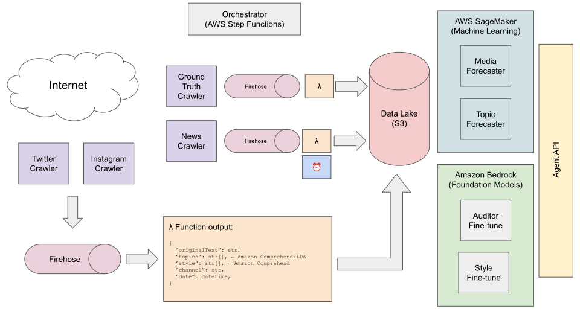

# Crypto AI Agent

## Assessment

* Pick a profile of a celebrity you would choose to replicate as an AI Agent that is relevant in the
Crypto Space.
* Please present to us the steps you would take in order to guide the AI agent with information in order
for it to create content on X and Instagram like the celebrity would, naturally (or better).
* Please clarify what information you would feed the agent, and how you would go about selecting this
information it would get fed and or how the agent would vet this information
* Please provide us with a basic backend MVP of the agent you would build in the technical stack of
your choice (please present this to us on Github)

## Minimum Viable Product

This folder contains the implementation of a dockerized Python API with a single endpoint `/generate` capable of creating a post upon request.

### Setup

1. Clone the project:
    ```bash
    git clone https://github.com/davizuku/crypto-banter.git
    ```
2. Move to the new folder:
    ```bash
    cd crypto-banter/crypto_ai_agent
    ```
3. Set up the environment variables by creating an account on [OpenRouter](https://openrouter.ai/docs/quickstart):
    ```bash
    cp .env.example .env
    # Fill in your API Key
    ```
4. Start the API:
    ```bash
    docker-compose up --build
    ```
5. Access the URL: http://localhost:8000/generate

## Data Engineering

As can be seen, the code does not crawl any actual data and only uses mock data to generate a response. In order to ensure a proper behavior of the agent, real data has to be obtained. In this section I will present my proposal for what data to use and how to obtain it.

### What to use and why?

Given the scenario of an agent that has to generate posts for social media in the same style as a top voice in the Crypto world, I consider the following concepts important:
- Topic: What should be the post about? What does the person usually write about? The agent should mimic the frequency and topics of the real person.
- Personality: Once the topic has been chosen, the post must reflect the personality of the crypto expert. In order to model this, I've chosen two features: "tone" and "style". The style is inherent to the person, and the tone could vary from post to post, but probably the person is biased towards a certain tones.
- Media (channel, schedule): What social media platforms does the top voice use? How frequently posts in each of them? What time does the person usually post? Is there a particular distribution of topics across the platforms? These are questions that would be great to have data to answer them. The agent should keep the same balance as the original person.
- Ground Truth: Since the agent is emulating a prominent figure, the contents must be highly curated and auditing its veracity should be a critical step in the post creation pipeline. This type of data intends to help building the foundation to automatically audit the new posts.
- News: Although breaking news could fit into the previous section, I highlight it separately because it can trigger urgent, topic-specific posts. This could be another input for choosing the topic of the next post.

### Data pipelines

In the diagram below, you can see my proposed diagram with actual pieces of infrastructure to process all the data described in the previous section:



Let's dive deeper into each component in more detail:
- Crawlers will be implemented as AWS Lambda or AWS Batch jobs, depending on the expected duration and complexity. These jobs will scrape websites to collect new information.
- The new information would be pushed to a Data Lake in S3 via Firehose. This service allows adding a Lambda function to apply some transformations to the batch data. (Firehose + Lambda is a possible ideal scenario, but it'll require deeper considerations). These transformations would imply obtaining the topic and styles from the text. This can be partially done with serverless services like Amazon Comprehend. Other LLMs can be used for this purpose as well.
    - As mentioned, the processing of news could trigger some *Alarms* that can be handled to take further actions.
- Once all information is in the S3 data lake, it is ready to build the prediction models that will be used by the main Agent API.

### Models proposed
- "Classic" Machine Learning models, using SageMaker for orchestrating training and inference:
    - Media forecaster: a model capable of predicting the channel to use for the next post and the time of the post. Trained using the historic series of posts, and using the news as exogenous data, it could be used by the agent to decide the media details for the new post.
    - Topic forecaster: a model capable of predicting the topic to use for the next post. Similar to the previous model, it can be trained using the historic series of posts, using the news as exogenous data.
- LLM models hosted in Amazon Bedrock can be fine-tuned for specific tasks:
    - Style: given the style of historical posts, a model can be fine-tuned solely on reproducing the style of the top voice.
    - Auditor: given ground facts, news, and fake news, a model can be trained on deciding if a new text is fake or not. (This can be approached with "classic" ML as well)

# Further work
- Connect the pieces with the API
- Add tests to the Python code
- Describe the infrastructure in a IaC document such as Terraform.
